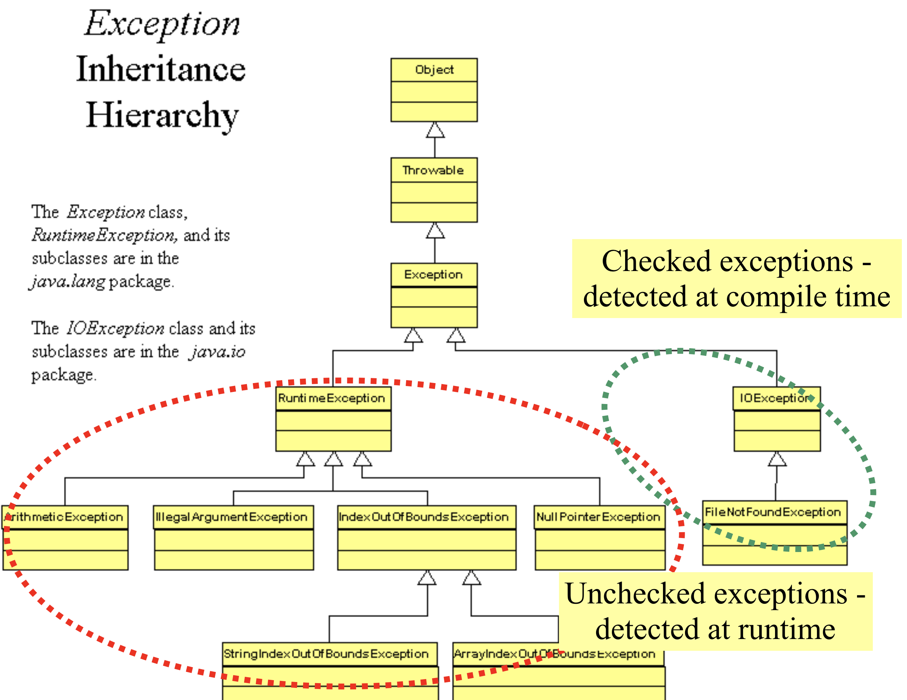

# Object-Oriented Programming - Recursion and Exceptions

In this lab:

* What is recursion?
* How can recursion be used to solve problems?
* Base cases in recursion.
* Throwing exceptions.
* `try`-`catch`

## What is recursion?

Recursion has many (related) descriptions across mathematics and computer science. In programming, a method is **recursive** if it calls itself.

For example, the following method is recursive:

```java
static void recurse()
{
	recurse();
}
```

The method above is also useless; beyond that, it creates an infinite recursive loop when called: the `recurse` method calls the `recurse` method, which calls the `recurse` method ...

Calling this method won't actually lead to unending recursion. It will instead lead to a `StackOverflowError`; the stack of recursive calls (in which each recursive call is "on top of" the call that it was made in) overflows, i.e. gets too large for the space allocated to it.

## How can recursion be used to solve problems?

In mathematics, a formula is recursive if it is defined "by itself" (except in a few base cases, generally). For example, the fibonacci numbers are defined as follows:

* `fib(0) = 0`
* `fib(1) = 1`
* `fib(n) = fib(n-1) + fib(n-2)` if `n >= 2`

That is, the fibonacci sequence is defined explictly for its first two elements, which are `0` and `1`. Any element later on in the sequence can be found by adding up the previous two elements. Here the first two elements, which are defined non-recursively, are called the **base cases**. You've likely seen the fibonacci sequence before. It's first few elements look like this:

`0, 1, 1, 2, 3, 5, 8, 13, 21, 34, ...`

Recursive methods can be used to derive values in recursive formulas. For example, the following method finds the n'th fibonacci number (it requires that `java.security.InvalidParameterException` is imported):

```java
static int fib(int n)
{
    // If the input is invalid, throw an exception
    if (n < 0)
    {
        throw new InvalidParameterException("Negative input " + n + " is invalid for fibonacci.");
    }

    // Base cases
    if (n == 0)
    {
        return 0;
    }
    if (n == 1)
    {
        return 1;
    }

    // Recurse if a base case wasn't met
    return fib(n-1) + fib(n-2);
}
```

Generally, it is better to solve simple recursive problems iteratively instead (or to find a closed-form solution), but recursion is often useful in more complex situations where finding a simplified iterative or close-form solution is not so simple.

Too see why an iterative solution might be better, consider running `fib(7)`. In order to find `fib(7)`, we must find `fib(6)` and `fib(5)`. In order to find `fib(6)`, we must find `fib(5)` and `fib(4)`. Already the problem starts to show itself: we've have to find `fib(5)` twice. We'll end up having to find `fib(4)` three times, `fib(3)` five times, `fib(2)` eight times, `fib(1)` thirteen times, and `fib(0)` eight times. While this might seem like a small inefficiency, it leads to repeating work which increases exponentially with the size of the initial input.

We could avoid repeating this work with the following iterative solution:

```java
static int fib(int n)
{
    // If the input is invalid, throw an exception
    if (n < 0)
    {
        throw new InvalidParameterException("Negative input " + n + " is invalid for fibonacci.");
    }

    // Base cases
    if (n == 0)
    {
        return 0;
    }
    if (n == 1)
    {
        return 1;
    }

    // iterate
    int a = 0;
    int b = 1;
    int index = 1;
    while (index < n)
    {
        int temp = b;
        b += a;
        a = temp;
        index++;
    }
    return b;
}
```

This solution avoids repeating work. Of course, it could be translated back to a recursive solution which doesn't repeat work either (though it is a bit harder to interpret, and uses an overloaded method):

```java
static int fib(int n)
{
    // If the input is invalid, throw an exception
    if (n < 0)
    {
        throw new InvalidParameterException("Negative input " + n + " is invalid for fibonacci.");
    }

    // Base cases
    if (n == 0)
    {
        return 0;
    }
    if (n == 1)
    {
        return 1;
    }

    // start the recursive call if not a base case:
    return fib(n-1, 1, 0);
}

static int fib(int n, int b, int a)
{
    if (n == 0)
    {
        return b;
    }
    return fib(n-1, a+b, b);
}
```

I digress, we are going down a rabbit hole. The key takeaways here are:

* methods can call themselves, and this is called recursion
* recursion can be used to solve solve problems
* recursion can be translated to iteration and back
* sometimes, it is simpler to use recursion when close-form or iterative solutions are hard to derive

<a name="q1"></a> **[EXERCISE 1](#a1)** Consider the following iterative method:

```java
static void countdownToLiftoff(int start)
{
    if (start < 0)
    {
        throw new InvalidParameterException("Houston, we have a problem.");
    }

    while (start > 0)
    {
        System.out.println(start + "...");
        start--;
    }
    System.out.println("Liftoff!");
}
```

Try this method with `10` as its argument. Try it with `-1`. What is the output in each case? (You'll need to import `java.security.InvalidParameterException`)

<a name="q2"></a> **[EXERCISE 2](#a2)** Convert the `countdownToLiftoff` method to a recursive equivalent.

<a name="q3"></a> **[EXERCISE 3](#a3)** Consider the [solution to **EXERCISE 2**](#a2). What happens if the `if` statement containing the base case is left out of the method?

<a name="q4"></a> **[EXERCISE 4](#a4)** Triangular numbers are numbers defined by the following pattern:

* `triangle(1) = 1`
* `triangle(2) = 1 + 2`
* `triangle(3) = 1 + 2 + 3`
* `triangle(4) = 1 + 2 + 3 + 4`
* etc

They are meant to reflect the number of "blocks" in a triangle, like one of these:

```
                                                                              *
                                                            *               * *
                                            *             * *             * * *
                              *           * *           * * *           * * * *
                  *         * *         * * *         * * * *         * * * * *
        *       * *       * * *       * * * *       * * * * *       * * * * * *
*     * *     * * *     * * * *     * * * * *     * * * * * *     * * * * * * *
```

Trianglular numbers can be identically defined with a base case and a recursive formula:

* `triangle(1) = 1`
* `triangle(n) = triangle(n-1) + n` if `n > 1`

Write a recursive method to calculate triangular numbers. Test it by ensuring that it gets the first 10 triangular numbers right. They are: `1, 3, 6, 10, 15, 21, 28, 36, 45, 55`. Make sure your method deals with invalid inputs and has a base case!

## Throwing Exceptions

We've already thrown exceptions in a few labs without really talking about it in detail. An exception is essentially an object containing details about an error. If an exception is thrown and not caught, the program will error out and print the data contained by the exception.

There are two main categories of exceptions: checked and unchecked. Unchecked exceptions don't need to be declared or explicitly dealt with in order to be thrown; you can simply throw any unchecked exception without deciding how to deal with it. Checked exceptions, on the other hand, must be explicitly declared: any method which can throw them must have `throws <checked exception's name>` at the end of its declaration, and any method which calls a method which throws a checked exception must itself throw this same checked exception or must handle the exception with a `try`-`catch` (which we will discuss briefly).

That was a lot of ungrounded information; let's go over an example of a checked and an unchecked exception before moving on. One checked exception that we've used already is the `FileNotFoundException` from `java.io`. Consider the following method. It instantiates a `File` with a string denoting a path to a file, then instantiates and returns a `Scanner` using that `File` as its input.

```java
static Scanner openFileFromPath(String path) throws FileNotFoundException
{
    File file = new File(path);
    return new Scanner(file);
}
```

The call to the `File` constructor has a chance to throw a `FileNotFoundException`, if the specified path does not lead to a file. `FileNotFoundException` is a checked exception. This means that `openFile` must either:

* be declared with the possibility that it will throw a `FileNotFoundException`
* catch (i.e. specify how to "deal with") the `FileNotFoundException` if it occurs.

Unchecked exceptions are less... needy. Consider the following method:

```java
static int divide(int a, int b)
{
    return a / b;
}
```

This method can throw an `ArithmeticException` from `java.lang`, if `b` is zero. `java.lang.ArithmeticException` is an unchecked exception, meaning it does not need to be declared or caught and will just be thrown, resulting in an error in the console.

Java distinguishes between checked and unchecked exceptions as follows: Exceptions that are subclasses of `Error` or of `RuntimeException` are unchecked, and any other exceptions are checked.



## Throwing Exceptions

Generally, the most common way to throw an exception is to construct it with an error message denoting what went wrong. For example, this `divide` method is identical to the one above:

```java
static int divide(int a, int b)
{
    if (b == 0)
    {
        throw new ArithmeticException("/ by zero");
    }
    return a / b;
}
```

## `try`-`catch`

Sometimes, it is convenient to run some statements which might result in an error, and to decide what to do in the case of an error. In other words, it is convenient to `try` to run some code which is likely to `throw` an error, and to `catch` the resulting error and decide what to do with it.

The following method finds the sum of an array of integers. If normal traversal were skydiving with a parachute, this would be skydiving without a parachute with a target trampoline in mind; it's purpose is to demonstrate the `try` `catch` and absolutely not to demonstrate how to traverse an array:

```java
static int sum(int[] operands)
{
    int i = 0;
    int sum = 0;
    while (true)
    {
        try
        {
            sum += operands[i];
            i++;
        }
        catch(ArrayIndexOutOfBoundsException e)
        {
            return sum;
        }
    }
}
```

<a name="q5"></a> **[EXERCISE 5](#a5)** Write and test a function which prompts the user for a file path (from the working directory, i.e. the location of the .class files) and tries to open that file, in a loop, until the user enters a valid file path, and then returns a scanner with the opened file as its source.

<a name="q6"></a> **[EXERCISE 6](#a6)** In the [solution to **EXERCISE 5**](#a5), `FileNotFoundException` is a checked exception. Why doesn't the `openFileFromUserPath()` method need `throws FileNotFoundException` on the end of its declaration?

<a name="q7"></a> **[EXERCISE 7](#a7)** Write and test recursive method to find the greatest common divisor of two positive integers *m* and *n*. Define `gcd(m, n)` as follows:

* error and base cases:
	* if `m < 0`, then `gcd(m, n)` is undefined (throw an exception)
	* if `m < n`, then `gcd(m, n) = gcd(n, m)`
	* if `n == 0`, then `gcd(m, n) = m`
* recursive case:
	* `gcd(m, n) = gcd(n, remainder(m, n))`
		* `remainder(m, n)` is the remainder of division of `m` by `n`; we have an operand for that :)

## Answers to Selected Exercises

### <a name="a1"></a> **[EXERCISE 1](#q1)**

When given `10` as an argument, the output is:

```
10...
9...
8...
7...
6...
5...
4...
3...
2...
1...
Liftoff!

Process finished with exit code 0
```

When given `-1`, it is:

```
Exception in thread "main" java.security.InvalidParameterException: Houston, we have a problem.
	at CountdownClient.countdownToLiftoff(CountdownClient.java:14)
	at CountdownClient.main(CountdownClient.java:7)

Process finished with exit code 1
```

### <a name="a2"></a> **[EXERCISE 2](#q2)**

```java
static void countdownToLiftoff(int start)
    {
        // check for invalid inputs
        if (start < 0)
        {
            throw new InvalidParameterException("Houston, we have a problem.");
        }

        // base case
        if (start == 0)
        {
            System.out.println("Liftoff!");
            return;
        }

        // recursive case
        System.out.println(start + "...");
        countdownToLiftoff(start-1);
    }
```

### <a name="a3"></a> **[EXERCISE 3](#q3)**

If the base case is left out, then the method recurses downward "forever". Conceptually, it is an infinite loop, but it will eventually be stopped by a `StackOverflowError`.

### <a name="a4"></a> **[EXERCISE 4](#q4)**

```java
static int triangle(int n)
{
    // check for invalid inputs
    if (n < 1)
    {
        throw new InvalidParameterException("Non-positive triangular number!");
    }

    // base case
    if (n == 1)
    {
        return 1;
    }

    // recursive case
    return n + triangle(n-1);
}
```

### <a name="a5"></a> **[EXERCISE 5](#q5)**

```java
import java.io.File;
import java.io.FileNotFoundException;
import java.util.Scanner;

public class FileClient
{
    public static void main(String[] args)
    {
        Scanner userFile = openFileFromUserPath();
        while (userFile.hasNext())
        {
            System.out.println(userFile.nextLine());
        }
    }

    static Scanner openFileFromUserPath()
    {
        Scanner scan = new Scanner(System.in);
        while (true)
        {
            try
            {
                System.out.print("Enter a file name > ");
                String userPath = scan.nextLine();
                return new Scanner(new File(userPath));
            }
            catch (FileNotFoundException e)
            {
                System.out.println("File not found. Try again.");
            }
        }
    }
}
```

### <a name="a6"></a> **[EXERCISE 6](#q6)**

The `FileNotFoundException` is caught by the `try`-`catch`, so the method never actually throws a `FileNotFoundException`; instead, it deals with these exceptions (by printing a message stating what went wrong).

### <a name="a7"></a> **[EXERCISE 7](#q7)**

```java
import java.util.Scanner;

public class GCDClient
{
    public static void main(String[] args)
    {
        Scanner console = new Scanner(System.in);

        System.out.print("Enter two positive integers > ");
        int m = console.nextInt();
        int n = console.nextInt();

        System.out.println("The greatest common divisor of " + m + " and " + n + " is " + gcd(m, n));
    }

    static int gcd(int m, int n)
    {
        if (m < 0)
        {
            throw new IllegalArgumentException("Negative input in gcd");
        }
        if (m < n)
        {
            return gcd(n, m);
        }
        if (n == 0)
        {
            return m;
        }
        return gcd(n, m%n);
    }
}

```

# Lab Assignment

Study for your final! Review previous labs. Make sure you understand how to throw exceptions and use `try`-`catch`, as these will be used on the final. 
